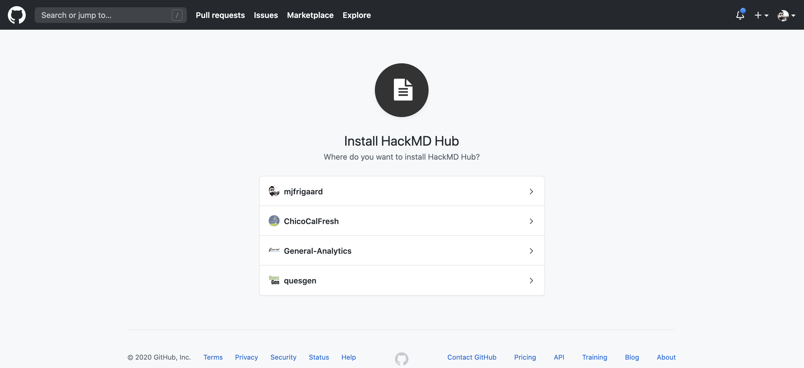

# HackMD sync with Github
#git #programming
- - - -

## Create new HackMD note
Go to HackMD and create a new note. 

Down in the lower left corner, select the option for a template (I chose **Try it!**). This loads the template with a bunch of boilerplate language. 

## Create Github repo (or use existing) 

To sync this with Github, I also created a repo called, **hackmd-notes**

In the **Options**, I selected the **Versions and Github Sync**, 

### Address Line Break Rendering Rule

I was asked about switching line endings, which I selected **Switch Now**. 

The next window gives the following options:

I want to **Push to Github**, and the next dialogue box displays the repositories, but first I need to authorize HackMD on Github. Click on the **Authorize more repos**, 

This opens a new window in the browser and asks which repos I want to add, 

I chose the mjfrigaard account, and click **Install & Authorize**. When this is done, we are redirected back to HackMD and we can see the account linked under **Integration**. 

Back in my HackMD window, I **Refresh** the list of repos and select the `hackmd-notes` from the list. In the other dropdown boxes, I had to type in `master` and `README.md`

I create a version and add a description, then click **Push**. Now when I head back over to the repo, I see the HackMD file has been pushed, 

- - - -

